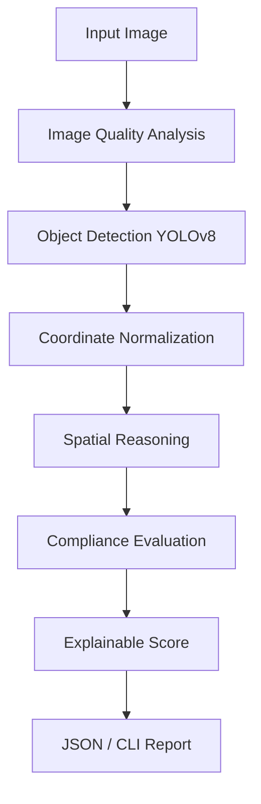
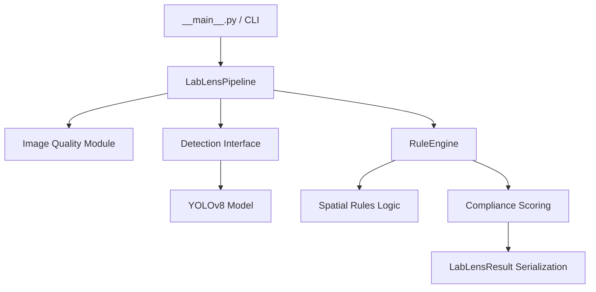

<div style="font-family: 'Times New Roman', Times, serif;">

<h1 align="center">Lab-lens</h1>
<h2 align="center">Vision-Based Laboratory Equipment Verification & Spatial Compliance System</h2>

<h3 style="color: skyblue;">1. Project Overview</h3>
Lab Lens solves the problem of automated verification for laboratory equipment setups. Ensuring that the correct apparatus is present and spatially arranged according to a standard operating procedure is traditionally a manual, repetitive task. Lab Lens accepts a 2D RGB laboratory image as input, applies a YOLOv8-based computer vision model to detect equipment, normalizes the workspace geometry, and uses a deterministic spatial reasoning engine to evaluate configurable rules. The system produces a structured JSON and human-readable text report containing an explainable compliance score and a list of identified spatial violations. Lab Lens is a research/academic prototype designed to demonstrate the integration of object detection and explicit spatial logic; it is not a certified physical safety system.

<h3 style="color: skyblue;">2. Problem Statement</h3>
Laboratory setup verification often requires checking whether expected equipment is present and whether detected equipment satisfies explicitly defined spatial constraints. Manual verification is repetitive, error-prone, and can be difficult to standardize. Lab Lens explores a computer-vision-based approach that detects laboratory apparatus and evaluates configurable geometric setup rules, helping automate setup verification.

<h3 style="color: skyblue;">3. Objectives</h3>
- Detect up to 25 categories of laboratory equipment from images.
- Validate image quality (blur, brightness, contrast) before inference.
- Normalize detection bounding boxes into relative spatial coordinates.
- Evaluate configurable geometric spatial relationships (e.g., `left_of`, `inside`).
- Identify explicitly missing, extra, or misplaced equipment.
- Generate explainable compliance reports and deterministic numerical scores.

<h3 style="color: skyblue;">4. Functional Modules</h3>
1. **Image Quality & Preprocessing**
   - *Input*: Raw RGB Image, configuration thresholds.
   - *Processing*: Calculates Laplacian variance for blur, and pixel statistics for brightness/contrast.
   - *Output*: Image quality status and warnings array.
2. **Object Detection**
   - *Input*: Raw RGB Image.
   - *Processing*: Executes a YOLOv8n forward pass to detect laboratory equipment.
   - *Output*: List of `Detection` objects (class name, bounding box, confidence).
3. **Spatial Reasoning**
   - *Input*: Normalized detections, expected `SetupSpecification`.
   - *Processing*: Evaluates counts and boundary conditions based on geometric Cartesian logic.
   - *Output*: Array of satisfied rules and specific spatial violations.
4. **Compliance Evaluation & Scoring**
   - *Input*: Spatial reasoning outputs, total configured conditions.
   - *Processing*: Calculates `(Satisfied Conditions / Total Conditions) * 100` and assigns a status category.
   - *Output*: Deterministic 0-100 float score, categorical compliance status.
5. **Reporting/CLI**
   - *Input*: Aggregated pipeline execution results.
   - *Processing*: Serializes the data into deterministic JSON or formats it into human-readable console strings.
   - *Output*: Standard output (JSON payload or formatted CLI block).

<h3 style="color: skyblue;">5. Functional Requirements</h3>
- **FR-01**: Image ingestion and loading.
- **FR-02**: Image quality analysis (blur, lighting).
- **FR-03**: Laboratory equipment detection via YOLOv8.
- **FR-04**: Detection coordinate normalization (0.0 to 1.0).
- **FR-05**: Spatial-rule evaluation (e.g., `left_of`, `right_of`, `above`, `below`, `inside_region`, `overlaps`, `near`, `far`).
- **FR-06**: Missing/extra/misplaced equipment detection.
- **FR-07**: Compliance status generation (`COMPLIANT`, `NON_COMPLIANT`, `UNSPECIFIED`, `ERROR`).
- **FR-08**: Explainable numerical scoring based on explicit condition coverage.
- **FR-09**: Deterministic JSON reporting.
- **FR-10**: End-to-end CLI execution.

<h3 style="color: skyblue;">6. Non-Functional Requirements</h3>
- **NFR-01 Reliability**: Missing relational targets or undefined boundaries in configuration safely trigger explicit violations rather than silently passing (verified in spatial engine logic).
- **NFR-02 Error Handling**: Unreadable images, missing models, and YAML parsing errors gracefully fallback to a safe `ERROR` state with explanatory string warnings without hard-crashing the pipeline.
- **NFR-03 Reproducibility**: The dataset generation, mathematical cross-split leak repair, and baseline model training utilize deterministic seeds and explicit scripts, allowing consistent regeneration.
- **NFR-04 Determinism**: Given the same mock detections and setup rules, the scoring engine deterministically returns identically sequenced JSON arrays and floating-point scores.

<h3 style="color: skyblue;">7. System Workflow</h3>


<h3 style="color: skyblue;">8. System Architecture</h3>


<h3 style="color: skyblue;">9. Technologies Used</h3>
| Category | Technology | Purpose |
|---|---|---|
| Language | Python | Core logic, scripting, testing |
| Machine Learning | PyTorch / Ultralytics YOLOv8 | Object detection architecture and inference |
| Computer Vision | OpenCV | Image reading, array manipulation, Laplacian blur detection |
| Math / Arrays | NumPy | Bounding box calculations and coordinate normalization |
| Configuration | PyYAML | Parsing setup definitions and validation rules |
| Testing | pytest | Unit and integration testing |
| Version Control | Git / GitHub | Repository management and history tracking |

<h3 style="color: skyblue;">10. Dataset</h3>
Lab Lens uses the **ChemEq25** dataset for object detection training.
- **Dataset Name**: ChemEq25
- **Source**: Figshare (CC BY 4.0)
- **Taxonomy**: 25 categories of chemistry laboratory equipment.
- **Original Dataset**: 4,599 images.
- **Leakage Handling**: Exact-duplicate image hashes were mathematically identified and purged.
- **Malformed Annotations**: Out-of-bounds bounding boxes and invalid geometries were deterministically repaired or dropped.
- **Repaired Training Dataset**: 4,458 images (Train: 3,103, Validation: 900, Test: 455).

*Note: ChemEq25 provides ONLY object detection bounds. It is NOT used as spatial-compliance ground truth.*

<h3 style="color: skyblue;">11. Model Selection</h3>
**YOLOv8n** was selected for object detection. A nano-variant architecture was chosen over larger foundation models due to practical CPU constraints, providing a fast inference/training tradeoff suitable for a research prototype without requiring specialized GPU hardware for evaluation.

<h3 style="color: skyblue;">12. Training Methodology</h3>
The current weights represent a short, CPU-friendly baseline integration checkpoint, not a heavily tuned deployment model:
- **Architecture**: YOLOv8n
- **Image Size**: 640
- **Batch Size**: 8
- **Epochs**: 3
- **Hardware**: CPU
- **Seed**: 42
- **Data**: Full repaired ChemEq25 training split. The model checkpoint was selected based on optimal validation performance.

<h3 style="color: skyblue;">13. Detector Evaluation</h3>
| Metric | Validation (Epoch 3) | Held-Out Test Split |
|---|---|---|
| **Precision** | 0.86165 | 0.83925 |
| **Recall** | 0.85265 | 0.83862 |
| **mAP50** | 0.89721 | 0.88067 |
| **mAP50-95** | 0.61170 | 0.59600 |

*mAP50 represents Mean Average Precision at a 50% Intersection over Union (IoU) threshold. mAP50-95 represents the average over IoU thresholds from 50% to 95%.*

<h3 style="color: skyblue;">14. Spatial Reasoning</h3>
The geometric spatial engine evaluates coordinates within a top-left origin (0.0 to 1.0) normalized Cartesian plane. Implemented relations include:
- `left_of`, `right_of`, `above`, `below` (evaluated using centroid geometry).
- `inside_region`, `overlaps` (evaluated using bounding box intersection over target area limits).
- `near`, `far` (evaluated using Euclidean distance against configurable thresholds).
Multiple objects of the same class (e.g., `Beaker_1`, `Beaker_2`) are iterated exhaustively. Counts are strictly validated against the YAML configuration.

<h3 style="color: skyblue;">15. Spatial Ground-Truth Strategy</h3>
A. **Synthetic Canonical Fixtures**: The geometric engine logic is validated against 21 mathematically exact, static synthetic fixtures.
B. **Real-World AI-Generated Silver Demonstrations**: 16 authentic, licensed lab photographs are utilized for integration testing. These use AI-generated annotations explicitly tagged as `SILVER_LABEL`.
**There is currently no human-verified real-world spatial-compliance benchmark in this repository.**

<h3 style="color: skyblue;">16. Compliance Evaluation</h3>
The pipeline assigns one of the following terminal states:
- `COMPLIANT`: All explicit required setup conditions and rules are met.
- `NON_COMPLIANT`: At least one explicit condition is violated (missing object, extra object, misplaced object).
- `UNSPECIFIED`: No setup configuration was supplied, or it contained zero explicitly required conditions.
- `AMBIGUOUS`: The setup lacks crucial definitions (e.g., an undefined target region).
- `ERROR`: Pipeline execution failed (e.g., unreadable image file).

<h3 style="color: skyblue;">17. Explainable Compliance Score</h3>
**Score = (Satisfied Explicit Conditions / Total Explicit Conditions) × 100**
- Bounded between 0.0 and 100.0.
- Unspecified, Error, or Ambiguous states yield a `null` score to prevent misleading integers.
- *Example*: 3 out of 3 conditions satisfied = 100.0. 2 out of 4 conditions satisfied = 50.0.
- *Note*: Detector confidence is NOT treated as a safety probability; the score reflects configuration coverage only.

<h3 style="color: skyblue;">18. Robustness & Error Handling</h3>
- **Missing Targets**: If a spatial rule targets an object that is missing from the image, the rule does not crash or skip silently; it explicitly triggers a rule violation.
- **Unreadable Image**: Handled gracefully via `try/except` capturing OpenCV assertion errors.
- **Missing Setup**: Safely yields `UNSPECIFIED` and skips spatial execution without raising exceptions.
- **Extra Objects**: Auxiliary background objects not named in the config are safely ignored, maintaining the open-world logic of a lab. If a required object exceeds its expected count, an `EXTRA_OBJECT` violation is raised.

<h3 style="color: skyblue;">19. Project Structure</h3>
```text
Lab-lens/
├── configs/
│   ├── config.yaml
│   └── training.yaml
├── Dataset/
│   ├── SpatialComplianceReal/
│   │   ├── annotations/
│   │   └── metadata/
│   └── SpatialCompliance/
│       └── synthetic_fixtures.json
├── docs/
│   └── COMPLIANCE_SCORING.md
├── scripts/
│   ├── audit_dataset_pairs.py
│   ├── inspect_dataset.py
│   ├── repair_dataset_leakage.py
│   └── train_detector.py
├── src/
│   └── lab_lens/
│       ├── __main__.py
│       ├── pipeline.py
│       ├── detection/
│       ├── preprocessing/
│       └── spatial/
├── tests/
│   ├── integration/
│   └── unit/
├── README.md
├── requirements.txt
└── statement.md
```

<h3 style="color: skyblue;">20. Installation</h3>
```bash
# 1. Clone repository
git clone https://github.com/Ayush-kathil/Lab-lens.git
cd Lab-lens

# 2. Create a virtual environment (optional but recommended)
python -m venv .venv

# 3. Activate environment (Windows)
.venv\Scripts\activate

# 4. Install dependencies
pip install -r requirements.txt

# 5. Verify CLI installation
python -m lab_lens --help
```
*Note: Due to file sizes, the trained YOLOv8 model weights (`best.pt`) and the raw ChemEq25 dataset images must be downloaded or trained locally before running inference.*

<h3 style="color: skyblue;">21. Configuration</h3>
Lab Lens requires two configuration artifacts for full compliance execution:
1. **Model Weights**: A `.pt` file passed via `--model`.
2. **Setup Configuration**: A YAML file passed via `--setup`. This defines `setup_name`, `required_objects`, and `spatial_rules`. If omitted, the pipeline defaults to a safe `UNSPECIFIED` state and returns detection bounds only.

<h3 style="color: skyblue;">22. CLI Usage</h3>
**Basic inference without a setup:**
```bash
python -m lab_lens infer --image path/to/image.jpg --model weights/best.pt
```

**Compliance evaluation against a configuration:**
```bash
python -m lab_lens infer --image path/to/image.jpg --model weights/best.pt --setup configs/setup.yaml
```

**Output deterministic JSON:**
```bash
python -m lab_lens infer --image path/to/image.jpg --model weights/best.pt --setup configs/setup.yaml --json
```

<h3 style="color: skyblue;">23. Testing</h3>
Execute the test suite using pytest:
```bash
pytest tests/
```
The test suite validates image preprocessing, spatial geometry, deterministic JSON output, and compliance score bounding.
Current verified result: **94 passed**.

<h3 style="color: skyblue;">24. Example Results</h3>
**Example A (Compliant Demonstration):**
- Setup: 1 Beaker, 1 Flask. Rule: Beaker right_of Flask.
- Outcome: `COMPLIANT`
- Score: `100.0 / 100` (3 of 3 conditions satisfied).

**Example B (Non-Compliant Demonstration):**
- Setup: 1 Beaker, 1 Stand, 1 Flask. Rule: Beaker left_of Flask.
- Outcome: `NON_COMPLIANT`
- Violations: Missing Stand, Rule Failed.
- Score: `50.0 / 100` (2 of 4 conditions satisfied).

**Example C (Unspecified):**
- Setup: None provided.
- Outcome: `UNSPECIFIED`
- Score: `null`

*(These are examples executed against AI-generated silver labels for throughput demonstration, not certified benchmark accuracy).*

<h3 style="color: skyblue;">25. Performance</h3>
Demonstration timings observed on a standard CPU for a single image evaluation pipeline (including quality, detection, and spatial reasoning, excluding initial model allocation overhead):
- **Quality**: 0.2146 s
- **Detector**: 1.2731 s
- **Spatial Reasoning**: 0.0001 s
- **Scoring**: 0.0000 s
- **Pipeline Total**: ~1.5772 s
*Timing will vary heavily based on hardware capabilities and object volume.*

<h3 style="color: skyblue;">26. Design Decisions & Engineering Challenges</h3>
- **Cross-Split Duplicate Leakage**: An analysis of the original dataset revealed duplicate image hashes crossing train and test boundaries. A custom repair script was implemented to perform rigorous hash-based deduplication, ensuring benchmark integrity.
- **Malformed Annotations**: The source dataset contained mathematically invalid bounding boxes (x1 >= x2). A defensive preprocessing layer was engineered to normalize and drop impossible geometries deterministically.
- **Silent Fallback Prevention**: A major design challenge involved spatial rules targeting undetected objects. The architecture was specifically refactored to treat missing targets as strict spatial violations rather than skipping them, protecting against false-positive compliance outputs.

<h3 style="color: skyblue;">27. Limitations</h3>
- Short CPU-based training baseline; the detector is a prototype and not fully optimized.
- No human-verified real-world spatial benchmark currently exists; AI silver labels act as integration proxies.
- Spatial compliance relies strictly on user-defined configurations and cannot intuitively guess safety requirements.
- The compliance score is a measure of deterministic condition coverage, not a statistically calibrated physical safety probability.

<h3 style="color: skyblue;">28. Future Enhancements</h3>
- Expand to a large-scale human-annotated spatial benchmark dataset.
- Implement more complex relational dependencies (e.g., fluid connection representations).
- Optimize YOLOv8 weights via GPU training and hyperparameter tuning for production-grade occlusion handling.

<h3 style="color: skyblue;">29. References</h3>
- ChemEq25 Dataset Source: [Chemistry Lab Image Dataset Covering 25 Apparatus Categories. Figshare](https://figshare.com/articles/dataset/_b_Chemistry_Lab_Image_Dataset_Covering_25_Apparatus_Categories_b_/29110433)
- Ultralytics YOLOv8 Documentation: [https://docs.ultralytics.com](https://docs.ultralytics.com)

<h3 style="color: skyblue;">30. Academic / Safety Disclaimer</h3>
Lab Lens is an academic/research prototype for computer-vision-based equipment verification and configurable spatial compliance reasoning. Its compliance score represents satisfaction of explicitly configured conditions and is not a certification, statistical probability, or guarantee of physical laboratory safety.

## Submission Checklist
| Requirement | Status |
|---|---|
| Root README.md | Complete |
| Installation instructions | Complete |
| CLI execution | Complete |
| Testing instructions | Complete |
| 3+ functional modules | Complete |
| 4+ non-functional requirements | Complete |
| Dataset description | Complete |
| Model rationale | Complete |
| Evaluation methodology | Complete |
| Architecture/workflow | Complete |
| Limitations | Complete |
| References | Complete |
| statement.md | Complete |


</div>