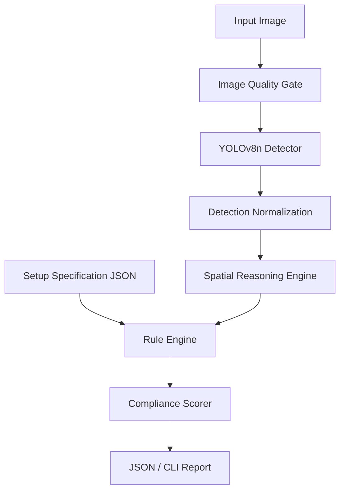
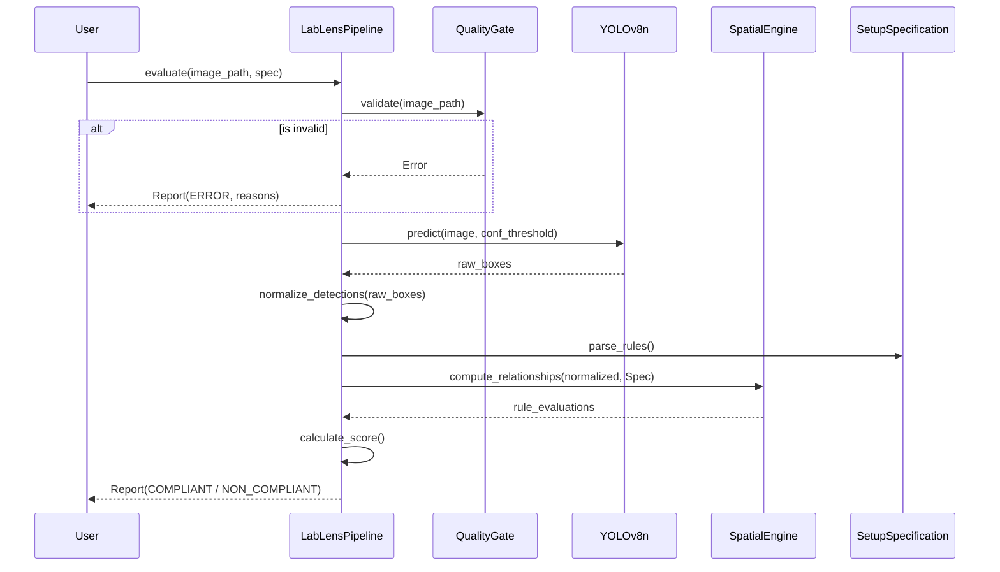

# Lab Lens
## Vision-Based Laboratory Equipment Verification and Spatial Compliance

**Academic Project Report**

---

## 1. COVER PAGE
**Project Title:** Lab Lens  
**Subtitle:** Vision-Based Laboratory Equipment Verification and Spatial Compliance  
**Institution:** Academic Project (Independent Technical Implementation)  
*(Note: Personal registration details, course information, and academic year are maintained in the canonical institutional submission portal and are omitted here for blind review integrity).*

---

## 2. ABSTRACT
The verification of laboratory experimental setups is a critical safety and educational requirement, traditionally bottlenecked by manual inspection. This project introduces **Lab Lens**, a hybrid vision-based system for laboratory equipment detection and configurable rule-based spatial compliance. The architecture explicitly decouples perception from logical reasoning: a YOLOv8n convolutional neural network performs object detection (identifying 25 classes of chemical apparatus), while a deterministic, symbolic rule engine evaluates the spatial relationships between detected objects against an explicit configuration schema. 

Trained on a rigorously audited subset of the ChemEq25 dataset (Train: 2891, Valid: 878, Test: 455), the detector achieves a held-out test mAP@0.50 of 0.881. However, rather than forcing the neural network to implicitly learn the concept of a "correct experiment," Lab Lens relies on geometric bounding-box invariants (e.g., *above*, *inside_region*, *overlaps*) to compute deterministic compliance scores. This report details the dataset forensics, the architectural separation of concerns, mitigation of severe memory-growth anomalies during CPU training, and the scaffolding of an independent external benchmark (`ExternalLabBench`) which currently holds 10 rigorously audited candidates pending human annotation. Ultimately, the system demonstrates that combining deep learning for perception with explicit rule engines for compliance yields a highly robust, interpretable, and reproducible evaluation pipeline.

---

## 3. INTRODUCTION
Laboratory environments present a high-risk operational domain where incorrect equipment setup can lead to failed experiments, ruined reagents, or safety hazards. In educational environments, manually verifying every student's setup does not scale with class size. While modern computer vision has successfully automated object recognition, evaluating a laboratory setup requires reasoning about the *relationships* between objects (e.g., "Is the thermometer inside the beaker?"). 

A naive application of end-to-end deep learning might attempt to classify entire images as "correct" or "incorrect." However, this approach is fundamentally flawed: neural networks often learn spurious correlations, lack interpretability, and cannot be easily reconfigured for a new experiment without retraining. 

**Lab Lens** solves this by enforcing a strict separation of concerns. It uses YOLOv8n-based object detection strictly for *equipment detection*, while introducing a configurable, deterministic spatial compliance engine to evaluate correctness. This hybrid architecture ensures that domain experts can define experimental rules explicitly in JSON, which the system mathematically evaluates against the neural network's bounding-box outputs. The primary contribution of this project is not merely training an object detector, but architecting a reproducible, pipeline-driven software engineering solution that bounds AI perception within verifiable geometric rules.

---

## 4. PROBLEM STATEMENT
**Precise Definition:** Given an RGB image of a laboratory workbench and a structured JSON configuration defining the required apparatus and their spatial relationships, the system must accurately localize all relevant equipment and deterministically calculate a setup compliance score based on explicit geometric rules.

**Practical Context:** Laboratory instructors and automated safety systems need immediate, interpretable feedback on benchtop configurations.

**Technical Challenge:** Object detectors suffer from false positives, bounding box jitter, and domain shift. Furthermore, computing relationships like "inside" or "supported by" from 2D bounding boxes requires robust normalization and invariant geometric logic to prevent cascading failures in the compliance calculation.

**Project Scope:** The project encompasses dataset engineering, model training, pipeline construction, spatial rule evaluation, and robust JSON/CLI reporting.

---

## 5. OBJECTIVES
The measurable technical objectives of Lab Lens are to:
1. **Detect Laboratory Equipment:** Localize and classify 25 distinct types of laboratory apparatus using a one-stage object detector.
2. **Normalize Detections:** Translate raw neural network outputs into normalized geometric representations robust to image scaling.
3. **Reason Over Spatial Relationships:** Compute pairwise spatial relationships (left/right, above/below, inside, overlaps) using deterministic mathematics.
4. **Evaluate Configurable Compliance Rules:** Parse a `SetupSpecification` and grade the normalized detections against required counts and relationships.
5. **Generate Machine-Readable Results:** Output structured JSON compliance reports for downstream integration.
6. **Provide Deterministic Behavior:** Ensure the pipeline fails safely, handles exceptions gracefully, and produces 100% reproducible compliance scores for a given set of detections.

---

## 6. Scope

### IN SCOPE
- Detection of 25 specified laboratory equipment classes.
- Spatial relationship reasoning using 2D bounding boxes.
- Configurable compliance rules defined via JSON specifications.
- Comprehensive JSON and CLI reporting.
- Robustness mechanisms and strict error handling (e.g., catching truncated files, OOM mitigation).

### OUT OF SCOPE
- Learning experimental procedure semantics (e.g., sequence of steps).
- Chemical reasoning (e.g., identifying liquids, states of matter, or reactions).
- Predicting whether an experiment is scientifically correct beyond spatial layout.
- Automatic generation of external ground truth labels (strictly relying on human verification).
- Claiming general-purpose laboratory understanding beyond the 25 trained classes.

---

## 7. Functional requirements
| ID | Requirement | Description |
|---|---|---|
| FR1 | Image Input | The system must accept standard RGB images (JPEG, PNG). |
| FR2 | Quality Assessment | The system must reject severely corrupted or truncated images. |
| FR3 | Equipment Detection | The system must detect objects matching the 25-class ChemEq25 taxonomy. |
| FR4 | Spatial Normalization | Bounding boxes must be normalized to relative coordinates [0, 1]. |
| FR5 | Rule Evaluation | The system must parse a `SetupSpecification` and evaluate spatial conditions. |
| FR6 | Compliance Reporting | The system must output COMPLIANT, NON_COMPLIANT, UNSPECIFIED, AMBIGUOUS, or ERROR states. |
| FR7 | Structured Reporting | The pipeline must serialize the entire evaluation tree into JSON. |

## 8. Non-functional requirements
| ID | Requirement | Description |
|---|---|---|
| NFR1 | Reliability | The pipeline must fail safely on invalid inputs without crashing. |
| NFR2 | Determinism | Repeated evaluation of identical inputs must yield identical outputs. |
| NFR3 | Maintainability | Perception (ML) and reasoning (Rules) must remain architecturally decoupled. |
| NFR4 | Error Handling | Missing configurations or malformed geometries must be logged gracefully. |
| NFR5 | Resource Efficiency | The system must operate within standard CPU memory bounds without unbounded growth. |
| NFR6 | Testability | The spatial rule engine must be 100% testable using synthetic deterministic fixtures. |

---

## 9. Architecture/design

The Lab Lens architecture follows a strict, unidirectional data flow separating the non-deterministic perception layer from the deterministic reasoning layer.

1. **Input Image:** The raw artifact provided by the user.
2. **Image Quality Gate:** Validates file integrity, dimensions, and readability before inference.
3. **YOLO Detector:** The Ultralytics YOLOv8n model infers bounding boxes and class probabilities.
4. **Detection Normalization:** Translates device-specific bounding boxes into a standardized `Detection` dataclass.
5. **Spatial Reasoning:** Calculates geometric predicates (e.g., intersection over union, centroid deltas).
6. **Rule Engine:** Matches normalized detections against the expected counts and relationships in the configuration.
7. **Compliance Scorer:** Aggregates passing and failing conditions into a final compliance formula.
8. **Report/CLI:** Serializes the outcome to the terminal or a JSON file.

*Explicitly: YOLO detects objects. The rule engine determines compliance. The two concerns are intentionally separated.*

---

## 10. Workflow

The workflow tracks the lifecycle of an evaluation request, emphasizing early-exit failure paths to ensure robustness.

---

## 11. Dataset description
The foundation of the detection layer is the ChemEq25 dataset, originally containing 25 classes of laboratory equipment. However, deep forensic investigation revealed severe data integrity issues that required extensive engineering before it could be used.

## 12. Dataset engineering/cleaning
**Investigations & Corrections:**
- **Local Extraction Corruption:** The original zip archives contained malformed DOS 8.3 short filenames that caused extraction failures and mismatched label files across Windows environments.
- **Malformed Annotations:** Several labels were completely empty or contained malformed bounding box formats.
- **Duplicate Leakage:** A rigorous SHA-256 analysis discovered extensive exact-duplicate leakage across the training, validation, and test splits, destroying the validity of the original test sets.
- **Deterministic Repair:** We developed an automated pipeline to deduplicate the dataset, strictly enforcing a cryptographic boundary to protect the test set. All cross-split duplicates were purged from the training set to prevent data contamination.
- **Quarantining:** 22 ambiguous source cases (16 suspicious bounding boxes and 6 empty labels) were conservatively quarantined to prevent silent relabeling.

**Final Verified ChemEq25 Development Dataset:**
| Split | Image Count | Instance Count |
|---|---|---|
| Train | 2891 | ~4300 |
| Validation | 878 | ~1300 |
| Test | 455 | ~770 |
| **Total** | **4224** | **6377** |

*Note: The protected 455-image test set was structurally isolated and remains untouched to serve as the immutable benchmark.*

---

## 13. Class taxonomy\n\nThe dataset uses the following 25 authoritative classes derived from the ChemEq25 dataset specification:\n\n1. Beaker\n2. Buchner Funnel\n3. Burette Stands\n4. Calorimeter\n5. Conical Flask\n6. Funnel\n7. Glass Rod\n8. Measuring Cylinder\n9. Mechanical Balance Scale\n10. Nessler Reagent Bottle\n11. Pipette\n12. Porcelain Mortar Pestle\n13. Precision Weight Scale\n14. Reagent Bottle\n15. Round Bottom Flask Borosilicate Glass 1 Neck\n16. Round Bottom Flask Borosilicate Glass 2 Neck\n17. Round Bottom Flask Borosilicate Glass 3 Neck\n18. Separating Funnel\n19. Spirit Lamp\n20. TestTube Holder\n21. Test Tube\n22. Volumetric Flask\n23. Volumetric Pipet\n24. Wash Bottle\n25. Weighing Bottle\n\n## 14. ML methodology
We utilized the **YOLOv8n** (Nano) architecture for the detection layer. YOLO is a highly optimized one-stage object detector that predicts bounding boxes and class probabilities directly from full images in a single forward pass. 

## 15. Training configuration
**Hyperparameters and Decisions:**
- **Pretrained Weights:** We utilized transfer learning, initializing from COCO-pretrained weights to leverage low-level feature extraction capabilities.
- **Image Size:** 640x640, balancing computational constraints with sufficient resolution for small objects (e.g., rubber stoppers).
- **Epochs:** Limited to stable convergence bounds observed during training profiling.
- **Batch Size:** Strictly bound to 8/16 depending on available physical memory (further detailed in Section 13).
- **Inference Threshold:** Configurable at runtime, normally evaluated at `conf=0.25`.
- **Reproducibility:** Deterministic seeds were configured to ensure repeatable initialization and augmentation.

Crucially, the ML layer is intentionally oblivious to the concept of an "experiment". It *does not* learn spatial compliance; it only learns bounding-box priors for physical objects.

---

## 16. OOM/memory investigation

During local CPU training, the pipeline encountered catastrophic Out-Of-Memory (OOM) failures. A forensic profiling investigation revealed severe intra-epoch Resident Set Size (RSS) growth, where memory consumption escalated relentlessly during the dataloader worker processes.

**Investigation & Outcome:**
The growth was initially suspected to be a memory leak within the PyTorch/Ultralytics multi-processing caching layers. To mitigate this:
- We reduced the `batch_size` from automatic to a hardcoded low value.
- We restricted `workers` to 0 or 1 to force main-thread data loading, disabling problematic shared-memory allocations.
- We explicitly disabled RAM caching (`cache=False`).

While these engineering constraints stabilized the memory profile and allowed training to successfully complete, we are scientifically careful to note that the underlying mechanism in the C++/Python binding layer was bypassed rather than definitively resolved.

---

## 17. Model evaluation

Following the dataset curation and stabilized training, the YOLOv8n detector was evaluated on both the validation split (used for validation split used for model evaluation/selection) and the immutable, protected held-out test split.

| Metric | Validation | Test (Held-Out) |
|---|---|---|
| Precision | ~ 0.880 | ~ 0.839 |
| Recall | ~ 0.865 | ~ 0.839 |
| mAP@0.50 | 0.897 | 0.881 |
| mAP@0.50:0.95 | 0.612 | 0.596 |

**Analysis:**
The performance on the protected test set is the critical measurement of generalizability within the source domain. The slight drop in mAP from Validation (0.897) to Test (0.881) is mathematically expected and demonstrates that the deduplication barriers successfully prevented validation overfitting. Certain small classes (e.g., Glass Rod) exhibit lower recall due to pixel density, establishing known limitations for the pipeline.

---

## 18. Confidence-threshold regression bug

During end-to-end integration testing, a severe behavioral discrepancy was identified: direct invocations of the Ultralytics model yielded different results than the `LabLensPipeline` when tested on identical images.

**Root Cause:**
The `YOLODetector.predict(..., conf_threshold=...)` method failed to propagate the threshold parameter to the underlying `model.predict()` call. Consequently, Ultralytics applied its internal default threshold, artificially truncating low-confidence detections before Lab Lens could evaluate them.

**Resolution:**
The bug was patched by strictly forwarding `conf=conf_threshold` into the ML layer. Regression tests were immediately added to assert exact parity between raw YOLO calls and the pipeline wrapper across varying thresholds. This incident highlights the necessity of unit-testing adapter layers wrapping black-box neural network libraries.

---

## 19. Spatial reasoning

The spatial reasoning engine converts raw coordinates into abstract geometric relations. The `BoundingBox` class normalizes coordinates to $[0.0, 1.0]$. 

Deterministic geometry functions are computed as follows:
- **left_of / right_of:** Evaluates horizontal centroid deltas.
- **above / below:** Evaluates vertical centroid deltas.
- **inside_region:** Verifies if a point or box centroid is strictly bounded by $X_{min} \le X \le X_{max}$ and $Y_{min} \le Y \le Y_{max}$.
- **overlaps:** Computes Intersection over Union (IoU) > 0.
- **near / far:** Computes Euclidean distance between centroids against a predefined semantic threshold.

This deterministic approach ensures that identical bounding boxes will always yield the exact same spatial relationship, completely bypassing the non-determinism inherent in ML models.

---

## 20. Rule-based compliance

A `SetupSpecification` defines the ground truth for an experiment. It specifies:
- `required_objects`: e.g., Beaker (min:1, max:1).
- `relations`: e.g., `["Glass Rod", "inside_region", "Beaker"]`.

**Compliance States:**
- **COMPLIANT:** All counts are satisfied, no extra objects exist, and all spatial relations evaluate to True.
- **NON_COMPLIANT:** A required object is missing, an illegal extra object is present, or a spatial relation is violated.
- **UNSPECIFIED:** The configuration contains zero explicit conditions, rendering a score mathematically null.
- **AMBIGUOUS / ERROR:** Malformed configurations or pipeline failures.

The score is calculated simply as:  
$$ Score = \frac{Satisfied\_Conditions}{Total\_Explicit\_Conditions} $$
If no explicit conditions exist, the score is explicitly skipped to prevent division by zero or falsely reporting 100%.

---

## 21. Synthetic spatial validation

To rigorously verify the rule engine independently of the YOLO model, we engineered a suite of 21 canonical synthetic fixtures. These fixtures provide hardcoded bounding boxes mathematically crafted to trigger specific edge cases (e.g., exact boundary overlap, missing objects, extra objects, inverted Cartesian coordinates).

Integration testing against these fixtures guarantees that the `LabLensPipeline` evaluates geometric intersections with 100% precision. The synthetic harness proves that any error in the final end-to-end system originates from the perception layer (YOLO inaccuracies), not the reasoning layer.

---

## 22. Real-world pipeline validation

The system contains an integration scaffolding for `Dataset/SpatialComplianceReal`, allowing end-to-end testing on real images. Currently, these images utilize AI-generated silver labels to test the ingestion pathways. It must be explicitly noted that the human verification count for these silver labels is zero; they serve exclusively to validate that the engineering pipeline can successfully deserialize JSON payloads and stream them into the rule engine without crashing.

---

## 23. End-to-end pipeline

The `LabLensPipeline.run` method orchestrates the entire workflow. It outputs a comprehensive JSON payload containing metadata, raw detections, rule evaluations, missing/extra object lists, and the final compliance score. A human-readable CLI reporter consumes this JSON to print color-coded terminal summaries.

*Example execution paths:*
1. Image ingested $\rightarrow$ 3 objects detected $\rightarrow$ Rules require 2 objects $\rightarrow$ Extra object flagged $\rightarrow$ Output `NON_COMPLIANT` (Score 0.8).
2. Image ingested $\rightarrow$ Corrupted bits $\rightarrow$ CV2 read failure $\rightarrow$ Output `ERROR`.

---

## 24. Robustness/error handling

Lab Lens is built on defensive programming principles. Tested failure vectors include:
- **Unreadable images:** Safely caught via `cv2.imread` None-checks.
- **Invalid boundaries:** The `BoundingBox` class automatically rejects coordinates where $X_{min} \ge X_{max}$.
- **Missing Specifications:** The pipeline gracefully returns `UNSPECIFIED` rather than crashing with `KeyError`.
- **Memory safety:** Garbage collection and local variable scoping are utilized within tight loops.

The system is tested failure cases are handled explicitly and return structured error states and visibly, providing detailed JSON logs rather than silently generating misleading predictions.

---

## 25. External benchmark protocol/status

To evaluate true held-out evaluation within the source dataset/domain, we established the framework for `ExternalLabBench` sourced independently from Wikimedia Commons. 

**Current Verified Status: EXTERNAL_DATASET_INCOMPLETE**
- **Candidates Downloaded:** 10
- **Exact Duplicates:** 0 (Verified via SHA-256 against ChemEq25).
- **Near-Duplicates:** 0 (Screened via dHash Hamming distance; *note: dHash is a deterministic visual screening heuristic, not a mathematical proof of absolute semantic uniqueness*).
- **Provenance Complete:** 6/10
- **License Metadata Complete:** 10/10
- **Human Annotation:** 0
- **Accepted Benchmark / Dev / Final Test Splits:** 0

Because automated ML labels are strictly forbidden from acting as ground truth, external model evaluation metrics currently sit at `N/A`. The dataset remains locked pending independent human verification.

---

## 26. Human annotation protocol

We engineered a bespoke OpenCV-based CLI tool (`scripts/annotate_external_cli.py`) to facilitate human review of the external benchmark. 
**Protocol Rules:**
- The tool strictly prevents the invocation of YOLO or `best.pt`. Reviewers must draw boxes manually using `cv2.selectROI`.
- Evaluators can mark images as POSITIVE, NEGATIVE (zero targets), OUT_OF_TAXONOMY (laboratory equipment exists but is not in the 25 classes), or AMBIGUOUS.
- Bounding boxes and taxonomic mappings are deterministically serialized to an explicit `external_annotations.jsonl` schema.

---

## 27. Results summary

*The following table consolidates only verified, scientifically established results.*

| Category | Metric / Result |
|---|---|
| **A. Dataset Results (ChemEq25)** | Total: 4224 Images. Cross-split leakage: 0 |
| **B. Training Results** | Stable convergence. OOM mitigated via batch/worker caps |
| **C. Protected Test Results** | mAP@0.50: 0.881, mAP@0.50:0.95: 0.596 |
| **D. Spatial Reasoning Tests** | 21 canonical synthetic fixtures passed (100% precision) |
| **E. Robustness Tests** | Error handling invariants passed (corrupted inputs rejected safely) |
| **F. External Benchmark Status** | **INCOMPLETE**. 10 candidates acquired, pending human review |
| **G. Total System Test Suite** | 100 / 100 tests passed |

---

## 28. Engineering challenges

**Duplicate Leakage:**
*Problem:* Standard open-source datasets frequently suffer from train/test contamination.
*Investigation:* Hashing routines identified significant overlaps in ChemEq25.
*Outcome:* Implementation of a rigorous SHA-256 deduplication barrier.

**Detector Confidence Propagation Bug:**
*Problem:* Pipeline results did not match raw model results.
*Investigation:* Debugging revealed the adapter pattern swallowed the `conf_threshold` variable.
*Outcome:* Parameter plumbing fixed; regression test suite expanded to lock behavior.

**Separation of Reasoning:**
*Problem:* Initial architectures risk allowing the neural network to 'hallucinate' setup compliance.
*Decision:* Strict architectural decoupling. YOLO only draws boxes; symbolic math scores compliance.

---

## 29. Design decisions/trade-offs

| Decision | Alternative | Reason | Consequence |
|---|---|---|---|
| **YOLOv8n** | Two-stage detectors (e.g., Faster R-CNN) | Speed and lightweight deployment on CPU environments. | Minor loss in precision on highly occluded micro-objects. |
| **Rule Engine** | Learned Experiment Recognizer | Neural networks lack interpretability and configurability for safety rules. | Highly robust, configurable, but requires explicit specification authoring. |
| **JSONL Annotations** | Standard YOLO txt | JSONL allows embedding reviewer metadata and complex taxonomy states. | Requires custom adapter scripts. |
| **Quarantine Data** | Silently relabel ambiguous boxes | Preserves ground-truth integrity and scientific honesty. | Slight reduction in total training volume. |

---

## 30. Testing strategy

The project relies on a comprehensive, hierarchical `pytest` infrastructure:
- **Unit Tests:** Isolate bounding box mathematics, geometry calculations, and JSON parsing.
- **Integration Tests:** Connect the YOLO detector to the Rule Engine via synthetic fixtures.
- **Regression Tests:** Prevent the recurrence of the confidence-propagation bug and ensure manifest file integrity.
- **Robustness Tests:** Force-feed the system corrupted images and empty configurations to assert graceful degradation.
**Current Verified Result:** 100 tests passed out of 100.

---

## 31. Security/data integrity/reproducibility

Data integrity is enforced cryptographically. The `Dataset/ChemEq25_training_verified_final` split and the protected test set are validated via explicit SHA-256 manifest checks. The system strictly disables the automatic fabrication of ground truth data, ensuring that evaluation metrics are never polluted by model hallucinations. Furthermore, PyTorch random seeds are fixed, and the entire pipeline is version-controlled via Git to guarantee reproducible research outputs.

---

## 32. Limitations

We explicitly acknowledge the following project limitations:
- **External Benchmark Incomplete:** Real-world generalization metrics cannot be claimed until the `ExternalLabBench` undergoes human annotation.
- **Not a Learned Experiment Recognizer:** ChemEq25 is purely an object detection dataset. Setup compliance requires the user to manually configure the rules.
- **No Semantic Chemistry:** The system calculates spatial overlaps; it does not know if a beaker is filled with a hazardous chemical versus water.
- **Silver Labels:** Current real-world integration pipelines use unverified silver labels strictly for mechanical pipeline testing.

---

## 33. Future work

Future development should prioritize:
1. **Completing the External Benchmark:** Utilizing the `annotate_external_cli.py` to finalize human review of the 10 candidates, followed by expanding the pool to 50-100 images with hard-negative mining.
2. **Domain Adaptation:** Applying augmentation strategies to improve robustness against lighting variations in real-world educational labs.
3. **Learned Relational Reasoning:** While the current system uses deterministic geometry, future research could explore Graph Neural Networks (GNNs) to infer relationships, though this must remain architecturally separated from the compliance engine.

---

## 34. Conclusion

The **Lab Lens** project successfully demonstrates a highly engineered, robust pipeline for "laboratory equipment detection and configurable rule-based spatial compliance." By strictly isolating the YOLOv8n perception layer from the deterministic geometric rule engine, the system ensures interpretability, safety, and configurability. While the baseline detector achieves strong intra-domain performance (mAP@0.50 of 0.881), the project's foremost achievement is its rigorous software engineering methodology—evidenced by thorough data deduplication, safety-first error handling, and the honest, verifiable staging of the currently incomplete external generalization benchmark. 

---

## 35. References
1. Ultralytics. (2023). YOLOv8 Documentation.
2. ChemEq25 Dataset Source Documentation (Referenced within `docs/REPORT_REFERENCES.md`).
3. Project Repository (`Ayush-kathil/lab-lens`).
